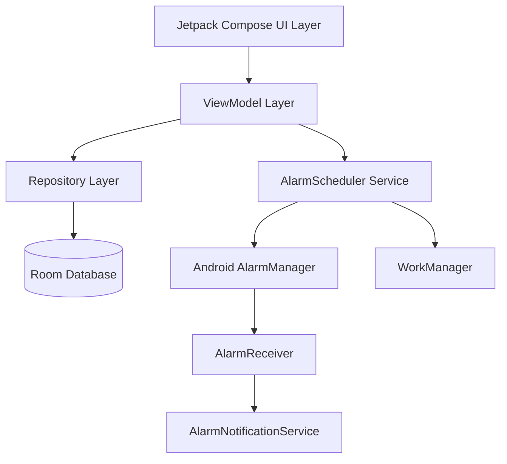
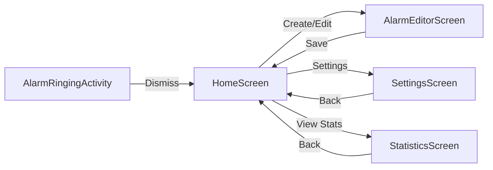
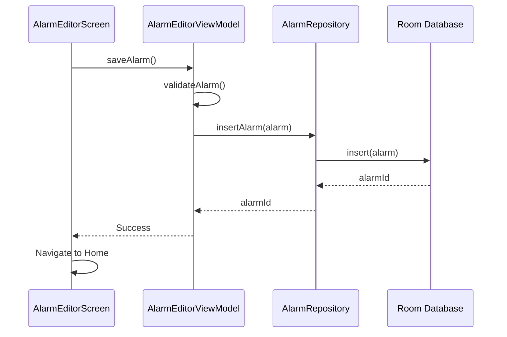
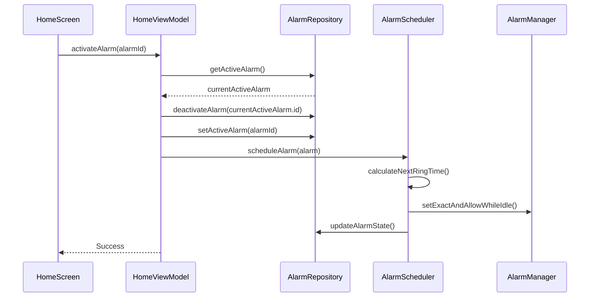
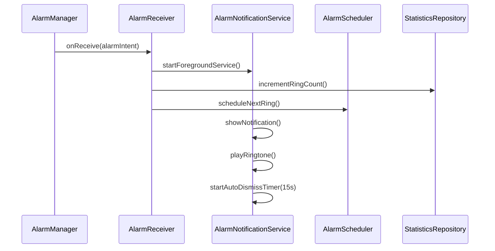
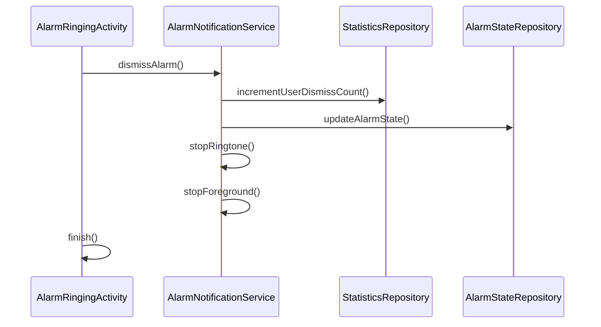
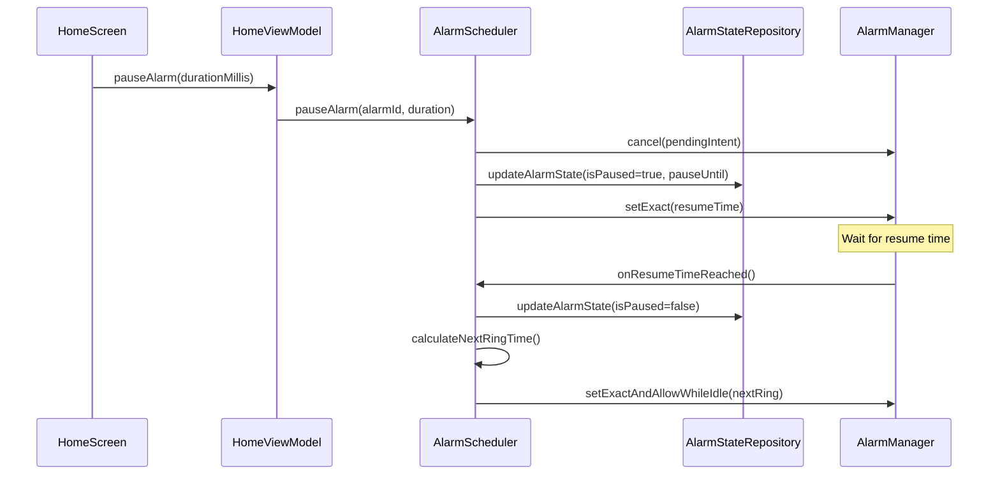

# Design Document

## Overview

"Letting In" is an Android interval alarm application built with Kotlin following modern Android architecture patterns. The app uses Jetpack Compose for UI, Room for local data persistence, WorkManager for reliable background alarm scheduling, and follows the MVVM (Model-View-ViewModel) architecture pattern. The design prioritizes lightweight operation, battery efficiency, and reliable alarm delivery even under restrictive Android power management conditions.

### Key Design Principles

1. **Single Responsibility**: Each component has a clear, focused purpose
2. **Lightweight Background Operation**: Minimal resource usage for background alarm scheduling
3. **Reliable Alarm Delivery**: Use Android AlarmManager for precise timing guarantees
4. **Offline-First**: All data stored locally with no network dependencies
5. **Material Design 3**: Modern, accessible UI following Android design guidelines

## Architecture

### High-Level Architecture



### Architecture Layers

1. **UI Layer (Jetpack Compose)**
   - Composable screens for home, alarm creation/editing, settings, and statistics
   - State management through ViewModels
   - Material Design 3 components

2. **ViewModel Layer**
   - Manages UI state and business logic
   - Coordinates between UI and repository
   - Handles alarm lifecycle operations

3. **Repository Layer**
   - Abstracts data sources
   - Provides clean API for data operations
   - Manages data transformations

4. **Data Layer (Room Database)**
   - Local persistence for alarm configurations
   - Statistics storage
   - App settings storage

5. **Alarm Scheduling Layer**
   - AlarmScheduler: Coordinates alarm scheduling
   - Uses AlarmManager for precise alarm timing
   - Uses WorkManager for periodic checks and recovery

6. **Notification Layer**
   - Handles full-screen intents
   - Manages notification channels
   - Plays ringtones and sounds

## Components and Interfaces

### Data Models


#### IntervalAlarm Entity

```kotlin
@Entity(tableName = "interval_alarms")
data class IntervalAlarm(
    @PrimaryKey(autoGenerate = true)
    val id: Long = 0,
    val label: String = "",
    val startTime: LocalTime,
    val endTime: LocalTime,
    val intervalMinutes: Int,
    val selectedDays: Set<DayOfWeek>,
    val isRepeatable: Boolean,
    val notificationType: NotificationType,
    val ringtoneUri: String,
    val isActive: Boolean = false,
    val createdAt: Long = System.currentTimeMillis(),
    val updatedAt: Long = System.currentTimeMillis()
)

enum class NotificationType {
    FULL_SCREEN,
    NOTIFICATION_POPUP,
    SOUND_ONLY
}
```

#### AlarmCycleStatistics Entity

```kotlin
@Entity(tableName = "alarm_statistics")
data class AlarmCycleStatistics(
    @PrimaryKey(autoGenerate = true)
    val id: Long = 0,
    val alarmId: Long,
    val cycleDate: LocalDate,
    val totalRings: Int = 0,
    val userDismissals: Int = 0,
    val autoDismissals: Int = 0,
    val cycleStartTime: Long,
    val cycleEndTime: Long?
)
```

#### AlarmState Entity

```kotlin
@Entity(tableName = "alarm_state")
data class AlarmState(
    @PrimaryKey
    val alarmId: Long,
    val lastRingTime: Long?,
    val nextScheduledRingTime: Long?,
    val isPaused: Boolean = false,
    val pauseUntilTime: Long?,
    val isStoppedForDay: Boolean = false,
    val currentDayStartTime: Long?,
    val todayRingCount: Int = 0,
    val todayUserDismissCount: Int = 0,
    val todayAutoDismissCount: Int = 0
)
```

#### AppSettings Entity

```kotlin
@Entity(tableName = "app_settings")
data class AppSettings(
    @PrimaryKey
    val id: Int = 1,
    val defaultIntervalMinutes: Int = 30,
    val defaultNotificationType: NotificationType = NotificationType.FULL_SCREEN,
    val themeMode: ThemeMode = ThemeMode.SYSTEM
)

enum class ThemeMode {
    LIGHT, DARK, SYSTEM
}
```

### Repository Interfaces

#### AlarmRepository

```kotlin
interface AlarmRepository {
    fun getAllAlarms(): Flow<List<IntervalAlarm>>
    fun getAlarmById(id: Long): Flow<IntervalAlarm?>
    fun getActiveAlarm(): Flow<IntervalAlarm?>
    suspend fun insertAlarm(alarm: IntervalAlarm): Long
    suspend fun updateAlarm(alarm: IntervalAlarm)
    suspend fun deleteAlarm(id: Long)
    suspend fun setActiveAlarm(id: Long)
    suspend fun deactivateAlarm(id: Long)
    suspend fun getAlarmCount(): Int
}
```

#### StatisticsRepository

```kotlin
interface StatisticsRepository {
    fun getStatisticsForAlarm(alarmId: Long): Flow<List<AlarmCycleStatistics>>
    suspend fun insertStatistics(statistics: AlarmCycleStatistics)
    suspend fun updateStatistics(statistics: AlarmCycleStatistics)
    suspend fun getTodayStatistics(alarmId: Long): AlarmCycleStatistics?
    suspend fun cleanupOldStatistics(alarmId: Long, keepCount: Int = 5)
}
```

#### AlarmStateRepository

```kotlin
interface AlarmStateRepository {
    fun getAlarmState(alarmId: Long): Flow<AlarmState?>
    suspend fun updateAlarmState(state: AlarmState)
    suspend fun deleteAlarmState(alarmId: Long)
    suspend fun resetDailyCounters(alarmId: Long)
}
```

### Core Services

#### AlarmScheduler

The AlarmScheduler is responsible for scheduling and managing alarm events using Android's AlarmManager.

```kotlin
interface AlarmScheduler {
    suspend fun scheduleAlarm(alarm: IntervalAlarm)
    suspend fun scheduleNextRing(alarmId: Long, nextRingTime: Long)
    suspend fun cancelAlarm(alarmId: Long)
    suspend fun pauseAlarm(alarmId: Long, pauseDurationMillis: Long)
    suspend fun resumeAlarm(alarmId: Long)
    suspend fun stopForDay(alarmId: Long)
}
```

**Implementation Details:**
- Uses `AlarmManager.setExactAndAllowWhileIdle()` for API 23+ to ensure alarms fire even in Doze mode
- Creates PendingIntent with unique request codes per alarm
- Stores alarm state in Room database for recovery after reboot
- Calculates next ring time based on interval and current time

#### AlarmReceiver

BroadcastReceiver that handles alarm events from AlarmManager.

```kotlin
class AlarmReceiver : BroadcastReceiver() {
    override fun onReceive(context: Context, intent: Intent) {
        // Extract alarm ID from intent
        // Start AlarmNotificationService
        // Update statistics
        // Schedule next ring
    }
}
```

#### AlarmNotificationService

Foreground service that displays alarm notifications and plays sounds.

```kotlin
class AlarmNotificationService : Service() {
    // Displays full-screen intent or notification
    // Plays ringtone using MediaPlayer
    // Handles dismiss and stop-for-day actions
    // Auto-dismiss after 15 seconds
}
```


#### BootReceiver

Handles device boot events to restore active alarms.

```kotlin
class BootReceiver : BroadcastReceiver() {
    override fun onReceive(context: Context, intent: Intent) {
        if (intent.action == Intent.ACTION_BOOT_COMPLETED) {
            // Query active alarm from database
            // Restore alarm scheduling
            // Calculate next ring time based on current time
        }
    }
}
```

#### RingtoneManager

Manages built-in ringtones and sound playback.

```kotlin
interface RingtoneManager {
    fun getAvailableRingtones(): List<RingtoneInfo>
    fun playRingtone(ringtoneUri: String, volumeLevel: Float)
    fun stopRingtone()
    fun playBeep()
}

data class RingtoneInfo(
    val id: String,
    val name: String,
    val uri: String,
    val durationSeconds: Int
)
```

### ViewModels

#### HomeViewModel

```kotlin
class HomeViewModel(
    private val alarmRepository: AlarmRepository,
    private val alarmStateRepository: AlarmStateRepository,
    private val statisticsRepository: StatisticsRepository,
    private val alarmScheduler: AlarmScheduler
) : ViewModel() {
    
    val allAlarms: StateFlow<List<IntervalAlarm>>
    val activeAlarm: StateFlow<IntervalAlarm?>
    val activeAlarmState: StateFlow<AlarmState?>
    val todayStatistics: StateFlow<AlarmCycleStatistics?>
    
    fun activateAlarm(alarmId: Long)
    fun deactivateAlarm(alarmId: Long)
    fun deleteAlarm(alarmId: Long)
    fun pauseAlarm(durationMillis: Long)
    fun resumeAlarm()
}
```

#### AlarmEditorViewModel

```kotlin
class AlarmEditorViewModel(
    private val alarmRepository: AlarmRepository,
    private val settingsRepository: SettingsRepository
) : ViewModel() {
    
    val alarmState: StateFlow<IntervalAlarm?>
    val defaultSettings: StateFlow<AppSettings>
    
    fun loadAlarm(alarmId: Long?)
    fun updateLabel(label: String)
    fun updateStartTime(time: LocalTime)
    fun updateEndTime(time: LocalTime)
    fun updateInterval(minutes: Int)
    fun toggleDay(day: DayOfWeek)
    fun updateNotificationType(type: NotificationType)
    fun updateRingtone(uri: String)
    fun updateCycleType(isRepeatable: Boolean)
    fun saveAlarm()
    fun validateAlarm(): ValidationResult
}
```

#### SettingsViewModel

```kotlin
class SettingsViewModel(
    private val settingsRepository: SettingsRepository
) : ViewModel() {
    
    val settings: StateFlow<AppSettings>
    
    fun updateDefaultInterval(minutes: Int)
    fun updateDefaultNotificationType(type: NotificationType)
    fun updateThemeMode(mode: ThemeMode)
}
```

#### StatisticsViewModel

```kotlin
class StatisticsViewModel(
    private val statisticsRepository: StatisticsRepository
) : ViewModel() {
    
    val statistics: StateFlow<List<AlarmCycleStatistics>>
    
    fun loadStatistics(alarmId: Long)
}
```

## UI Components

### Screen Structure

1. **HomeScreen**
   - Displays list of all alarms (active first, then inactive)
   - Shows active alarm details: next ring time, today's stats, time until end
   - Quick pause/resume button for active alarm
   - Create new alarm FAB (if under 10 alarms)
   - Navigate to settings

2. **AlarmEditorScreen**
   - Form fields for all alarm properties
   - Time pickers for start/end time
   - Interval selector (slider or number input)
   - Day of week selector (chip group)
   - Notification type selector (radio buttons)
   - Ringtone selector (dropdown)
   - Cycle type toggle (one-cycle vs repeatable)
   - Save and cancel buttons

3. **SettingsScreen**
   - Default interval setting
   - Default notification type setting
   - Theme selector (light/dark/system)
   - Notification permission status and action button
   - Battery optimization status and action button
   - App version and about information

4. **StatisticsScreen**
   - List of last 5 cycles for selected alarm
   - Each cycle shows: date, total rings, user dismissals, auto-dismissals
   - Simple bar chart or visual representation

5. **AlarmRingingActivity**
   - Full-screen activity for alarm notifications
   - Displays alarm label
   - Shows current time
   - Dismiss button (large, easy to tap)
   - Stop for day button (with confirmation)
   - Auto-dismiss countdown indicator

### Navigation Structure



## Data Flow

### Alarm Creation Flow



### Alarm Activation Flow



### Alarm Ring Flow




### Alarm Dismissal Flow



### Pause and Resume Flow



## Error Handling

### Error Categories

1. **Validation Errors**
   - Invalid time ranges (end time before start time)
   - Invalid interval (less than 5 minutes or greater than time range)
   - No days selected
   - Label exceeds 60 characters
   - Maximum alarm count reached (10)

2. **Permission Errors**
   - Missing notification permission
   - Missing exact alarm permission (Android 12+)
   - Missing full-screen intent permission
   - Battery optimization not disabled

3. **Scheduling Errors**
   - AlarmManager scheduling failure
   - System time change during active alarm
   - Device reboot during active alarm

4. **Data Errors**
   - Database write failure
   - Corrupted alarm data
   - Missing alarm state

### Error Handling Strategies

#### Validation Errors
- Display inline error messages in UI
- Prevent form submission until errors are resolved
- Provide helpful error messages with guidance

#### Permission Errors
- Check permissions before critical operations
- Show permission rationale dialogs
- Provide deep links to system settings
- Display persistent warnings in settings screen

#### Scheduling Errors
- Retry scheduling with exponential backoff
- Log errors for debugging
- Notify user if alarm cannot be scheduled
- Provide manual retry option

#### Data Errors
- Use database transactions for atomic operations
- Implement data migration strategies
- Provide data export/import functionality
- Log errors and provide user-friendly messages

### Recovery Mechanisms

1. **Boot Recovery**
   - BootReceiver restores active alarm on device restart
   - Recalculate next ring time based on current time
   - Verify alarm is still within active time window

2. **Time Change Recovery**
   - Detect significant time changes
   - Recalculate next ring time
   - Verify alarm hasn't exceeded end time
   - Continue interval cycle if valid

3. **Crash Recovery**
   - Persist alarm state before critical operations
   - Use WorkManager for periodic health checks
   - Restore alarm scheduling if missing

4. **Background Restriction Recovery**
   - Detect when app is restricted
   - Show notification to user
   - Provide guidance to disable restrictions

## Testing Strategy

### Unit Tests

1. **ViewModel Tests**
   - Test state management logic
   - Test alarm validation
   - Test pause/resume calculations
   - Mock repositories

2. **Repository Tests**
   - Test CRUD operations
   - Test data transformations
   - Use in-memory database

3. **AlarmScheduler Tests**
   - Test next ring time calculations
   - Test interval logic
   - Test day-of-week filtering
   - Test pause duration calculations
   - Mock AlarmManager

4. **Utility Tests**
   - Test time calculations
   - Test validation functions
   - Test data converters

### Integration Tests

1. **Database Tests**
   - Test Room database operations
   - Test migrations
   - Test complex queries
   - Test data integrity

2. **Alarm Flow Tests**
   - Test end-to-end alarm creation and activation
   - Test alarm ring and dismissal flow
   - Test pause and resume flow
   - Use Android Test framework

### UI Tests

1. **Screen Tests**
   - Test navigation between screens
   - Test form input and validation
   - Test list display and interactions
   - Use Compose Testing framework

2. **Accessibility Tests**
   - Test screen reader compatibility
   - Test touch target sizes
   - Test color contrast

### Manual Testing Scenarios

1. **Alarm Timing Accuracy**
   - Verify alarms ring at exact scheduled times
   - Test multiple intervals (5 min, 30 min, 1 hour)
   - Test across day boundaries

2. **Background Reliability**
   - Test with app in background
   - Test with app force-closed
   - Test after device reboot
   - Test in Doze mode

3. **Edge Cases**
   - Test with system time changes
   - Test with timezone changes
   - Test with Do Not Disturb mode
   - Test with low battery
   - Test with multiple rapid dismissals

4. **User Workflows**
   - Create, edit, delete alarms
   - Activate, pause, resume alarms
   - Stop for day functionality
   - View statistics

## Performance Considerations

### Battery Optimization

1. **Efficient Scheduling**
   - Use AlarmManager instead of continuous background service
   - Schedule only next ring, not all future rings
   - Cancel alarms when not needed

2. **Minimal Wake Locks**
   - Use wake locks only during alarm ring
   - Release wake locks immediately after dismissal
   - Use partial wake locks when possible

3. **Efficient Database Operations**
   - Use indexes on frequently queried columns
   - Batch database operations
   - Use Flow for reactive updates instead of polling

### Memory Optimization

1. **Lazy Loading**
   - Load alarm details only when needed
   - Use pagination for statistics if needed
   - Release resources when not in use

2. **Efficient Data Structures**
   - Use primitive types where possible
   - Avoid unnecessary object creation
   - Use data classes for immutability

### UI Performance

1. **Compose Optimization**
   - Use remember and derivedStateOf appropriately
   - Avoid unnecessary recompositions
   - Use LazyColumn for lists

2. **Smooth Animations**
   - Use hardware acceleration
   - Keep animations under 16ms per frame
   - Test on low-end devices

## Security Considerations

1. **Data Privacy**
   - All data stored locally
   - No network communication
   - No analytics or tracking

2. **Permission Handling**
   - Request minimum necessary permissions
   - Explain permission usage clearly
   - Handle permission denials gracefully

3. **Intent Security**
   - Use explicit intents for internal components
   - Validate intent extras
   - Use PendingIntent with FLAG_IMMUTABLE

## Technology Stack

### Core Technologies

- **Language**: Kotlin 1.9+
- **Minimum SDK**: Android 8.0 (API 26)
- **Target SDK**: Android 14 (API 34)
- **Build System**: Gradle with Kotlin DSL

### Android Jetpack Libraries

- **Compose**: UI framework (Material 3)
- **Room**: Local database (SQLite)
- **ViewModel**: UI state management
- **Navigation**: Screen navigation
- **WorkManager**: Background task scheduling
- **DataStore**: Settings storage

### Additional Libraries

- **Kotlin Coroutines**: Asynchronous programming
- **Kotlin Flow**: Reactive data streams
- **Hilt**: Dependency injection
- **JUnit**: Unit testing
- **Mockk**: Mocking framework
- **Espresso**: UI testing

## Build Configuration

### Module Structure

```
app/
├── src/
│   ├── main/
│   │   ├── java/com/lettingin/
│   │   │   ├── data/
│   │   │   │   ├── database/
│   │   │   │   ├── repository/
│   │   │   │   └── model/
│   │   │   ├── domain/
│   │   │   │   ├── usecase/
│   │   │   │   └── scheduler/
│   │   │   ├── ui/
│   │   │   │   ├── home/
│   │   │   │   ├── editor/
│   │   │   │   ├── settings/
│   │   │   │   ├── statistics/
│   │   │   │   └── alarm/
│   │   │   ├── service/
│   │   │   ├── receiver/
│   │   │   └── util/
│   │   ├── res/
│   │   └── AndroidManifest.xml
│   ├── test/
│   └── androidTest/
└── build.gradle.kts
```

### Required Permissions

```xml
<uses-permission android:name="android.permission.SCHEDULE_EXACT_ALARM" />
<uses-permission android:name="android.permission.USE_EXACT_ALARM" />
<uses-permission android:name="android.permission.POST_NOTIFICATIONS" />
<uses-permission android:name="android.permission.VIBRATE" />
<uses-permission android:name="android.permission.WAKE_LOCK" />
<uses-permission android:name="android.permission.RECEIVE_BOOT_COMPLETED" />
<uses-permission android:name="android.permission.FOREGROUND_SERVICE" />
<uses-permission android:name="android.permission.USE_FULL_SCREEN_INTENT" />
<uses-permission android:name="android.permission.REQUEST_IGNORE_BATTERY_OPTIMIZATIONS" />
```

## Future Enhancements

1. **User Authentication**
   - Cloud backup of alarm configurations
   - Sync across devices
   - Account management

2. **Advanced Features**
   - Gradual volume increase
   - Smart snooze suggestions
   - Integration with calendar events
   - Location-based alarms

3. **Analytics**
   - Extended statistics and insights
   - Usage patterns
   - Productivity metrics

4. **Customization**
   - Custom ringtone upload
   - Alarm themes
   - Widget support
