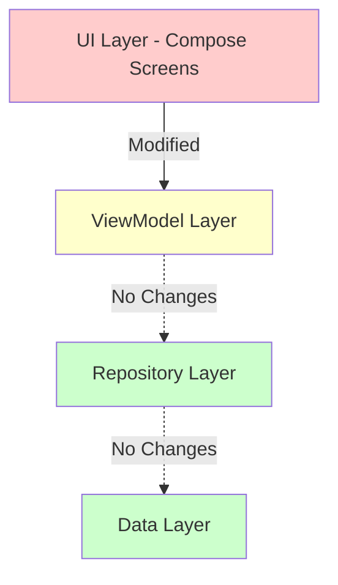
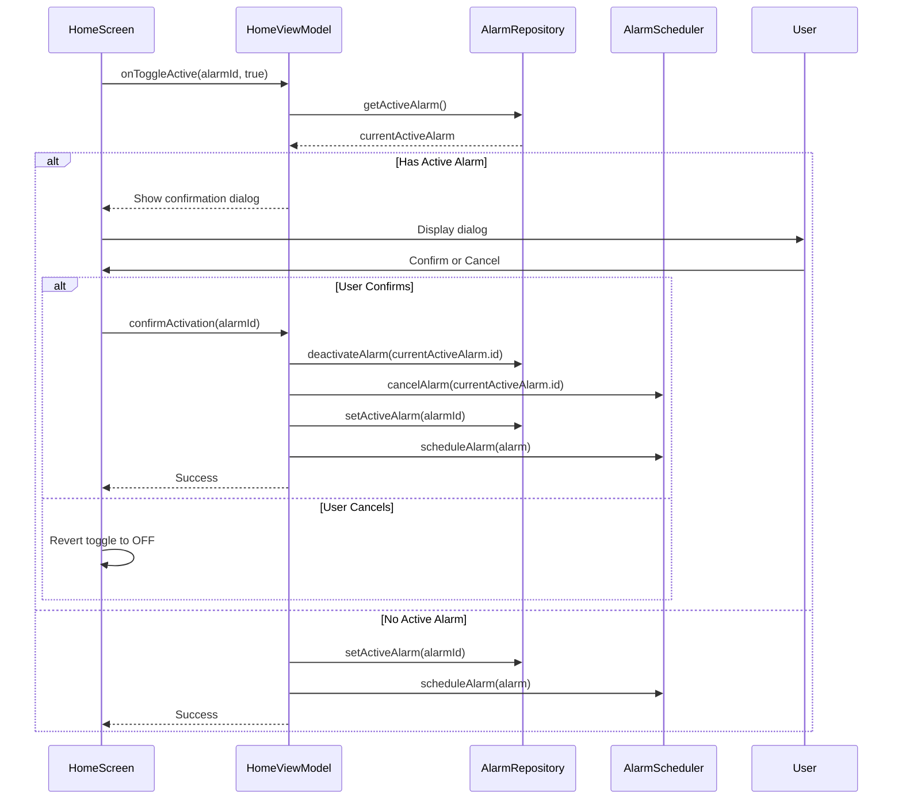
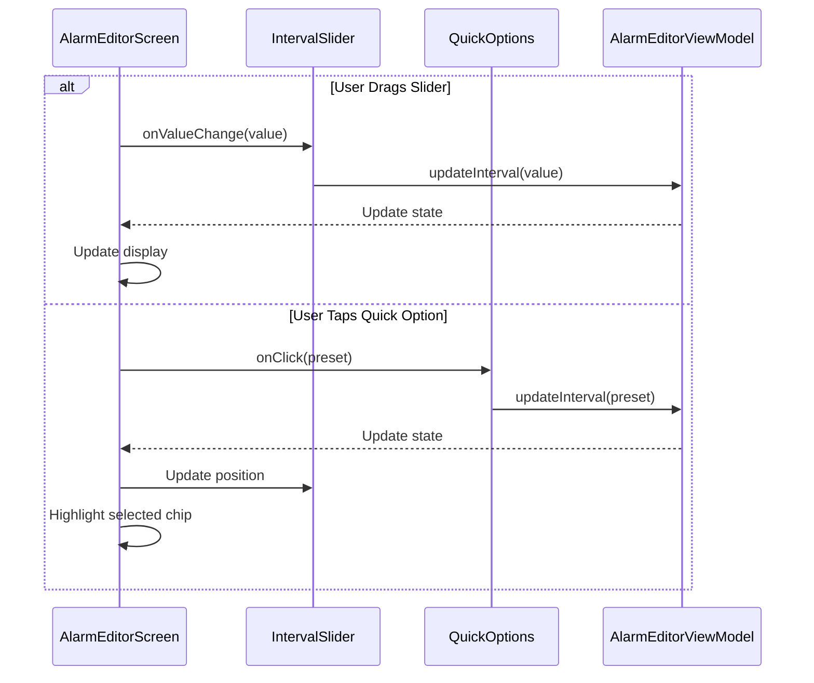
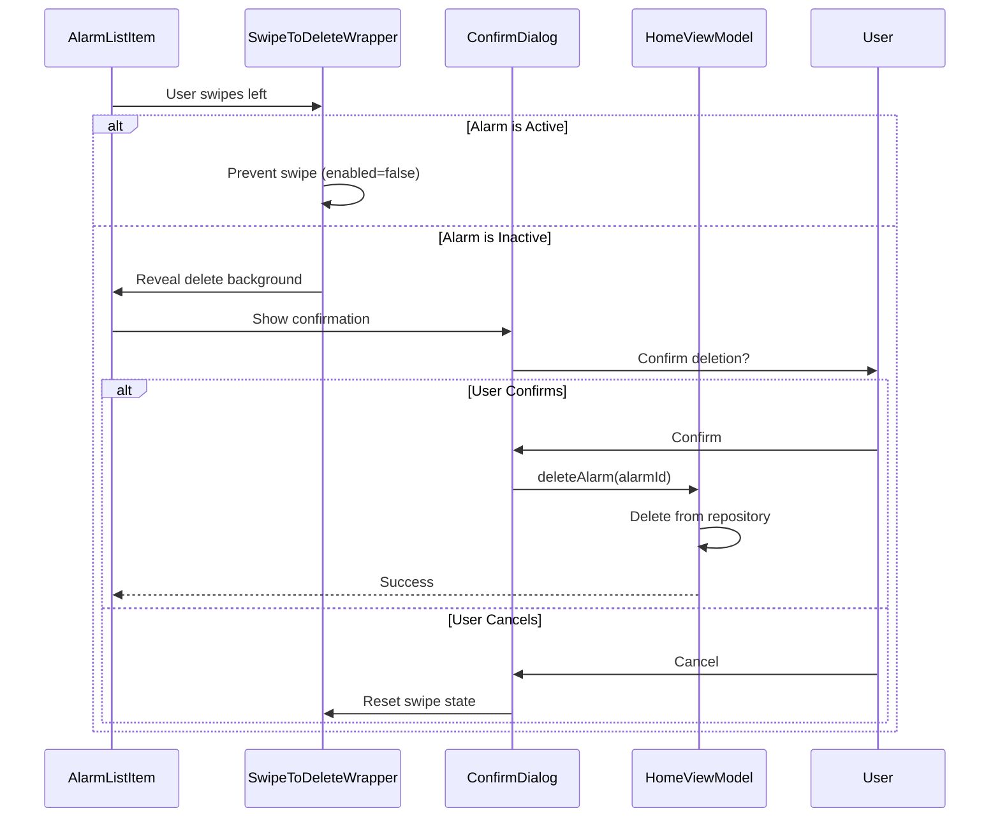
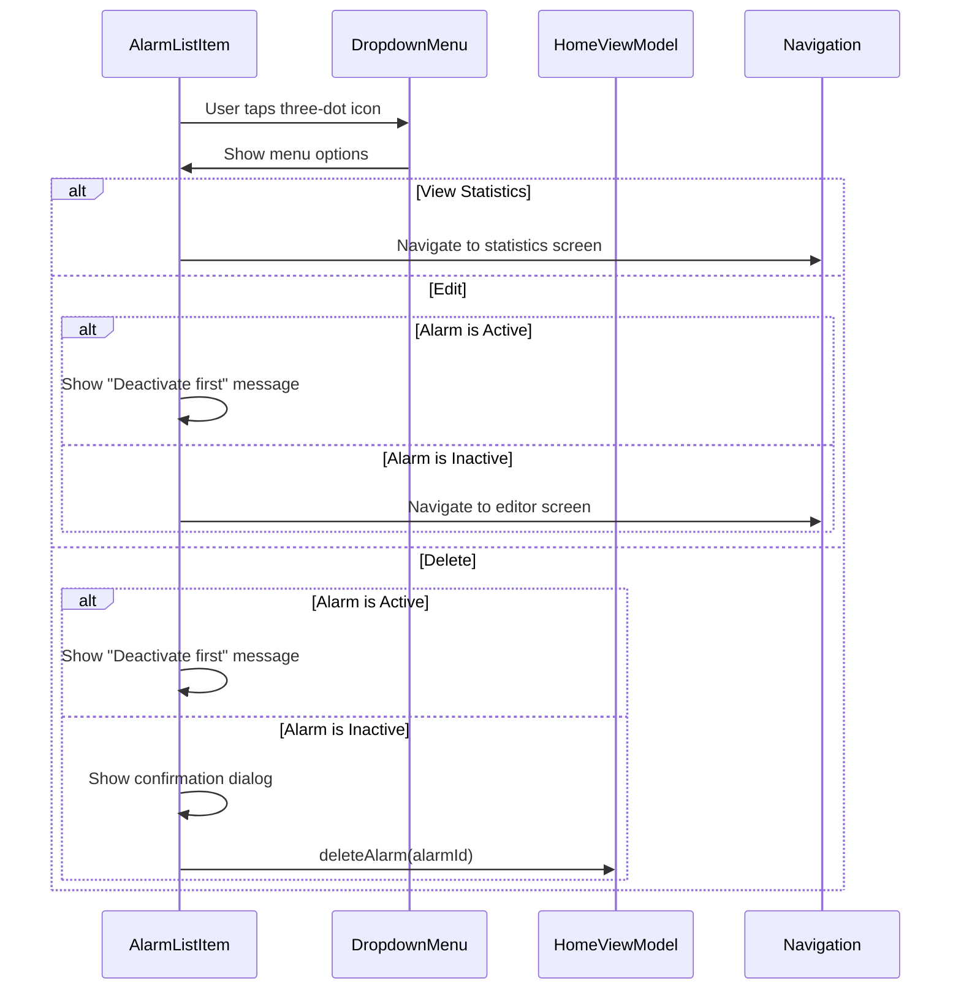

# Design Document

## Overview

This design document outlines the implementation approach for UI/UX improvements to the "Letting In" interval alarm application. The improvements focus on three key areas:

1. **24-Hour Time Format**: Replace AM/PM time display with 24-hour format (HH:mm) throughout the application
2. **Slider-Based Interval Selection**: Replace text field input with an intuitive slider control combined with quick preset buttons
3. **Toggle-Based Activation**: Replace X button with a Material Design switch for clearer alarm activation/deactivation

These changes enhance usability while maintaining all existing alarm functionality and business logic from the original specification.

### Design Principles

1. **Consistency**: Apply changes uniformly across all screens
2. **Clarity**: Make UI controls self-explanatory and reduce ambiguity
3. **Efficiency**: Enable faster user interactions with quick options and gestures
4. **Safety**: Prevent accidental actions through confirmations and clear visual feedback
5. **Backward Compatibility**: Preserve all existing alarm logic and data structures

## Architecture Impact

### Affected Components

The UI improvements primarily affect the presentation layer with minimal changes to business logic:



**Legend:**
- Red (Modified): Significant changes required
- Yellow (Minor Changes): Small modifications for confirmation dialogs
- Green (No Changes): No modifications needed

### Layer-by-Layer Impact

1. **UI Layer (High Impact)**
   - HomeScreen: Toggle switches, three-dot menu, swipe gestures
   - AlarmEditorScreen: Slider control, quick option buttons, 24-hour time pickers
   - All screens: 24-hour time formatting

2. **ViewModel Layer (Low Impact)**
   - Add confirmation dialog state management
   - No changes to core alarm logic

3. **Repository Layer (No Impact)**
   - All data operations remain unchanged

4. **Data Layer (No Impact)**
   - Database schema unchanged
   - Data models unchanged


## Components and Interfaces

### 1. Time Formatting Utility

Create a centralized utility for consistent 24-hour time formatting across the app.

```kotlin
object TimeFormatter {
    /**
     * Formats LocalTime to 24-hour format string (HH:mm)
     */
    fun format24Hour(time: LocalTime): String {
        return time.format(DateTimeFormatter.ofPattern("HH:mm"))
    }
    
    /**
     * Formats time range for display
     */
    fun formatTimeRange(startTime: LocalTime, endTime: LocalTime): String {
        return "${format24Hour(startTime)} - ${format24Hour(endTime)}"
    }
    
    /**
     * Formats timestamp to 24-hour format
     */
    fun format24Hour(timestamp: Long): String {
        val instant = Instant.ofEpochMilli(timestamp)
        val localTime = LocalDateTime.ofInstant(instant, ZoneId.systemDefault()).toLocalTime()
        return format24Hour(localTime)
    }
}
```

**Usage Locations:**
- HomeScreen: Next ring time, alarm list items
- AlarmEditorScreen: Time picker displays
- AlarmRingingActivity: Current time display
- StatisticsScreen: Cycle time displays

### 2. Interval Selector Component

A composite component combining slider and quick option buttons for interval selection.

```kotlin
@Composable
fun IntervalSelector(
    currentInterval: Int,
    minInterval: Int = 5,
    maxInterval: Int,
    onIntervalChange: (Int) -> Unit,
    modifier: Modifier = Modifier
) {
    Column(modifier = modifier) {
        // Current interval display
        Text(
            text = formatInterval(currentInterval),
            style = MaterialTheme.typography.titleLarge,
            modifier = Modifier.align(Alignment.CenterHorizontally)
        )
        
        Spacer(modifier = Modifier.height(8.dp))
        
        // Quick option buttons
        QuickIntervalOptions(
            currentInterval = currentInterval,
            maxInterval = maxInterval,
            onIntervalSelect = onIntervalChange
        )
        
        Spacer(modifier = Modifier.height(16.dp))
        
        // Slider control
        IntervalSlider(
            currentInterval = currentInterval,
            minInterval = minInterval,
            maxInterval = maxInterval,
            onIntervalChange = onIntervalChange
        )
    }
}

@Composable
private fun QuickIntervalOptions(
    currentInterval: Int,
    maxInterval: Int,
    onIntervalSelect: (Int) -> Unit
) {
    val quickOptions = listOf(15, 30, 45, 60).filter { it <= maxInterval }
    
    Row(
        modifier = Modifier.fillMaxWidth(),
        horizontalArrangement = Arrangement.SpaceEvenly
    ) {
        quickOptions.forEach { interval ->
            FilterChip(
                selected = currentInterval == interval,
                onClick = { onIntervalSelect(interval) },
                label = { Text("${interval}m") }
            )
        }
    }
}

@Composable
private fun IntervalSlider(
    currentInterval: Int,
    minInterval: Int,
    maxInterval: Int,
    onIntervalChange: (Int) -> Unit
) {
    val stepSize = calculateStepSize(maxInterval)
    
    Slider(
        value = currentInterval.toFloat(),
        onValueChange = { onIntervalChange(it.toInt()) },
        valueRange = minInterval.toFloat()..maxInterval.toFloat(),
        steps = ((maxInterval - minInterval) / stepSize) - 1,
        modifier = Modifier.fillMaxWidth()
    )
}

private fun calculateStepSize(maxInterval: Int): Int {
    return when {
        maxInterval < 60 -> 5
        maxInterval <= 180 -> 15
        else -> 30
    }
}

private fun formatInterval(minutes: Int): String {
    return when {
        minutes < 60 -> "$minutes minutes"
        minutes % 60 == 0 -> "${minutes / 60} hour${if (minutes > 60) "s" else ""}"
        else -> {
            val hours = minutes / 60
            val mins = minutes % 60
            "$hours hour${if (hours > 1) "s" else ""} $mins minutes"
        }
    }
}
```

**Integration:**
- Replace existing interval text field in AlarmEditorScreen
- Calculate maxInterval based on start/end time difference
- Preserve existing validation logic


### 3. Alarm List Item with Toggle and Menu

Enhanced alarm list item component with toggle switch, three-dot menu, and swipe-to-delete.

```kotlin
@Composable
fun AlarmListItem(
    alarm: IntervalAlarm,
    isActive: Boolean,
    onToggleActive: (Boolean) -> Unit,
    onEdit: () -> Unit,
    onDelete: () -> Unit,
    onViewStats: () -> Unit,
    modifier: Modifier = Modifier
) {
    var showMenu by remember { mutableStateOf(false) }
    
    SwipeToDeleteWrapper(
        enabled = !isActive,
        onDelete = onDelete,
        modifier = modifier
    ) {
        Card(
            modifier = Modifier.fillMaxWidth(),
            elevation = if (isActive) CardDefaults.cardElevation(4.dp) else CardDefaults.cardElevation(1.dp)
        ) {
            Row(
                modifier = Modifier
                    .fillMaxWidth()
                    .padding(16.dp),
                verticalAlignment = Alignment.CenterVertically
            ) {
                // Alarm info
                Column(
                    modifier = Modifier.weight(1f)
                ) {
                    Text(
                        text = alarm.label.ifEmpty { "Interval Alarm" },
                        style = MaterialTheme.typography.titleMedium
                    )
                    Text(
                        text = TimeFormatter.formatTimeRange(alarm.startTime, alarm.endTime),
                        style = MaterialTheme.typography.bodyMedium,
                        color = MaterialTheme.colorScheme.onSurfaceVariant
                    )
                    Text(
                        text = "Every ${alarm.intervalMinutes} min • ${formatDays(alarm.selectedDays)}",
                        style = MaterialTheme.typography.bodySmall,
                        color = MaterialTheme.colorScheme.onSurfaceVariant
                    )
                }
                
                // Toggle switch
                Switch(
                    checked = isActive,
                    onCheckedChange = onToggleActive,
                    modifier = Modifier.padding(horizontal = 8.dp)
                )
                
                // Three-dot menu
                Box {
                    IconButton(onClick = { showMenu = true }) {
                        Icon(Icons.Default.MoreVert, contentDescription = "More options")
                    }
                    
                    DropdownMenu(
                        expanded = showMenu,
                        onDismissRequest = { showMenu = false }
                    ) {
                        DropdownMenuItem(
                            text = { Text("View Statistics") },
                            onClick = {
                                showMenu = false
                                onViewStats()
                            },
                            leadingIcon = {
                                Icon(Icons.Default.BarChart, contentDescription = null)
                            }
                        )
                        DropdownMenuItem(
                            text = { Text("Edit") },
                            onClick = {
                                showMenu = false
                                onEdit()
                            },
                            leadingIcon = {
                                Icon(Icons.Default.Edit, contentDescription = null)
                            }
                        )
                        DropdownMenuItem(
                            text = { Text("Delete") },
                            onClick = {
                                showMenu = false
                                onDelete()
                            },
                            leadingIcon = {
                                Icon(Icons.Default.Delete, contentDescription = null)
                            }
                        )
                    }
                }
            }
        }
    }
}

@Composable
private fun SwipeToDeleteWrapper(
    enabled: Boolean,
    onDelete: () -> Unit,
    modifier: Modifier = Modifier,
    content: @Composable () -> Unit
) {
    if (!enabled) {
        content()
        return
    }
    
    val dismissState = rememberDismissState(
        confirmValueChange = {
            if (it == DismissValue.DismissedToStart) {
                onDelete()
                true
            } else {
                false
            }
        }
    )
    
    SwipeToDismiss(
        state = dismissState,
        directions = setOf(DismissDirection.EndToStart),
        background = {
            Box(
                modifier = Modifier
                    .fillMaxSize()
                    .background(MaterialTheme.colorScheme.error)
                    .padding(horizontal = 20.dp),
                contentAlignment = Alignment.CenterEnd
            ) {
                Icon(
                    imageVector = Icons.Default.Delete,
                    contentDescription = "Delete",
                    tint = MaterialTheme.colorScheme.onError
                )
            }
        },
        dismissContent = { content() },
        modifier = modifier
    )
}

private fun formatDays(days: Set<DayOfWeek>): String {
    if (days.size == 7) return "Every day"
    if (days.size == 5 && !days.contains(DayOfWeek.SATURDAY) && !days.contains(DayOfWeek.SUNDAY)) {
        return "Weekdays"
    }
    if (days.size == 2 && days.contains(DayOfWeek.SATURDAY) && days.contains(DayOfWeek.SUNDAY)) {
        return "Weekends"
    }
    return days.sortedBy { it.value }.joinToString(", ") { it.getDisplayName(TextStyle.SHORT, Locale.getDefault()) }
}
```

**Key Features:**
- Material Design 3 Switch component
- Three-dot menu with icons
- Swipe-to-delete for inactive alarms only
- Visual distinction for active alarm (elevated card)


### 4. Activation Confirmation Dialog

Dialog component to confirm switching active alarms.

```kotlin
@Composable
fun ActivationConfirmationDialog(
    currentActiveAlarmLabel: String,
    newAlarmLabel: String,
    onConfirm: () -> Unit,
    onDismiss: () -> Unit
) {
    AlertDialog(
        onDismissRequest = onDismiss,
        icon = {
            Icon(
                imageVector = Icons.Default.SwapHoriz,
                contentDescription = null,
                tint = MaterialTheme.colorScheme.primary
            )
        },
        title = {
            Text("Switch Active Alarm?")
        },
        text = {
            Column {
                Text(
                    text = "The alarm \"$currentActiveAlarmLabel\" is currently active.",
                    style = MaterialTheme.typography.bodyMedium
                )
                Spacer(modifier = Modifier.height(8.dp))
                Text(
                    text = "Activating \"$newAlarmLabel\" will deactivate the current alarm.",
                    style = MaterialTheme.typography.bodyMedium
                )
            }
        },
        confirmButton = {
            TextButton(onClick = onConfirm) {
                Text("Switch")
            }
        },
        dismissButton = {
            TextButton(onClick = onDismiss) {
                Text("Cancel")
            }
        }
    )
}
```

**Usage:**
- Triggered when user toggles an inactive alarm ON while another is active
- Shows current and new alarm labels for clarity
- Cancel action reverts toggle to OFF state

### 5. 24-Hour Time Picker Configuration

Configure Material3 TimePicker to use 24-hour format.

```kotlin
@OptIn(ExperimentalMaterial3Api::class)
@Composable
fun Time24HourPicker(
    initialTime: LocalTime,
    onTimeSelected: (LocalTime) -> Unit,
    onDismiss: () -> Unit
) {
    val timePickerState = rememberTimePickerState(
        initialHour = initialTime.hour,
        initialMinute = initialTime.minute,
        is24Hour = true  // Force 24-hour format
    )
    
    AlertDialog(
        onDismissRequest = onDismiss,
        confirmButton = {
            TextButton(
                onClick = {
                    val selectedTime = LocalTime.of(
                        timePickerState.hour,
                        timePickerState.minute
                    )
                    onTimeSelected(selectedTime)
                }
            ) {
                Text("OK")
            }
        },
        dismissButton = {
            TextButton(onClick = onDismiss) {
                Text("Cancel")
            }
        },
        text = {
            TimePicker(state = timePickerState)
        }
    )
}
```

**Key Configuration:**
- `is24Hour = true` parameter ensures 24-hour display
- No AM/PM toggle shown
- Hours range from 0-23


## Data Flow

### Toggle Activation Flow with Confirmation



### Interval Selection Flow



### Swipe to Delete Flow



### Menu Action Flow




## UI/UX Specifications

### Visual Design Guidelines

#### 1. Time Display Format

**Format Pattern:** `HH:mm`
- Hours: 00-23 (always two digits)
- Minutes: 00-59 (always two digits)
- Separator: colon (:)
- No AM/PM indicator

**Examples:**
- 9:00 AM → `09:00`
- 12:30 PM → `12:30`
- 3:45 PM → `15:45`
- 11:59 PM → `23:59`

**Typography:**
- Use monospace or tabular figures for alignment
- Consistent font size across similar contexts
- High contrast for readability

#### 2. Interval Selector Layout

```
┌─────────────────────────────────────┐
│         30 minutes                  │  ← Current value display
├─────────────────────────────────────┤
│  [15m]  [30m]  [45m]  [60m]        │  ← Quick option chips
├─────────────────────────────────────┤
│  ●━━━━━━━━━━━━━━━━━━━━━━━━━━━━○   │  ← Slider
│  5                            120    │  ← Min/max labels
└─────────────────────────────────────┘
```

**Spacing:**
- 8dp between value display and quick options
- 16dp between quick options and slider
- 16dp padding around entire component

**Colors:**
- Selected chip: Primary color
- Unselected chip: Surface variant
- Slider track: Primary color
- Slider thumb: Primary color

#### 3. Alarm List Item Layout

```
┌─────────────────────────────────────────────────┐
│  Medication Reminder                    ⚪ ⋮    │
│  09:00 - 17:00                                  │
│  Every 30 min • Mon, Tue, Wed, Thu, Fri        │
└─────────────────────────────────────────────────┘
```

**Active Alarm (elevated):**
```
┌─────────────────────────────────────────────────┐
│  Medication Reminder                    🟢 ⋮    │  ← Elevated card
│  09:00 - 17:00                                  │
│  Every 30 min • Mon, Tue, Wed, Thu, Fri        │
└─────────────────────────────────────────────────┘
```

**Swipe Left (inactive only):**
```
┌─────────────────────────────────────────────────┐
│                                          🗑️     │  ← Red background
│  ← Swipe to delete                              │
└─────────────────────────────────────────────────┘
```

**Component Sizes:**
- Switch: 48dp minimum touch target
- Three-dot icon: 48dp minimum touch target
- Card padding: 16dp
- Card elevation (active): 4dp
- Card elevation (inactive): 1dp

#### 4. Confirmation Dialog Design

```
┌─────────────────────────────────────┐
│           ⇄                         │  ← Swap icon
│                                     │
│    Switch Active Alarm?             │  ← Title
│                                     │
│  The alarm "Morning Routine" is     │
│  currently active.                  │
│                                     │
│  Activating "Medication Reminder"   │
│  will deactivate the current alarm. │
│                                     │
│         [Cancel]    [Switch]        │
└─────────────────────────────────────┘
```

**Button Styling:**
- Cancel: Text button, neutral color
- Switch: Text button, primary color
- Dialog width: 280dp minimum
- Padding: 24dp


## State Management

### HomeViewModel State Updates

Add state for confirmation dialog:

```kotlin
data class HomeUiState(
    val alarms: List<IntervalAlarm> = emptyList(),
    val activeAlarm: IntervalAlarm? = null,
    val activeAlarmState: AlarmState? = null,
    val todayStatistics: AlarmCycleStatistics? = null,
    val showActivationConfirmation: Boolean = false,
    val pendingActivationAlarmId: Long? = null,
    val isLoading: Boolean = false,
    val error: String? = null
)

class HomeViewModel(...) : ViewModel() {
    
    private val _uiState = MutableStateFlow(HomeUiState())
    val uiState: StateFlow<HomeUiState> = _uiState.asStateFlow()
    
    fun onToggleAlarm(alarmId: Long, shouldActivate: Boolean) {
        if (shouldActivate) {
            val currentActive = _uiState.value.activeAlarm
            if (currentActive != null && currentActive.id != alarmId) {
                // Show confirmation dialog
                _uiState.update {
                    it.copy(
                        showActivationConfirmation = true,
                        pendingActivationAlarmId = alarmId
                    )
                }
            } else {
                // No active alarm, activate directly
                activateAlarm(alarmId)
            }
        } else {
            deactivateAlarm(alarmId)
        }
    }
    
    fun confirmActivation() {
        val alarmId = _uiState.value.pendingActivationAlarmId ?: return
        dismissActivationConfirmation()
        activateAlarm(alarmId)
    }
    
    fun dismissActivationConfirmation() {
        _uiState.update {
            it.copy(
                showActivationConfirmation = false,
                pendingActivationAlarmId = null
            )
        }
    }
    
    private fun activateAlarm(alarmId: Long) {
        viewModelScope.launch {
            try {
                // Deactivate current active alarm if exists
                _uiState.value.activeAlarm?.let { currentActive ->
                    alarmRepository.deactivateAlarm(currentActive.id)
                    alarmScheduler.cancelAlarm(currentActive.id)
                }
                
                // Activate new alarm
                alarmRepository.setActiveAlarm(alarmId)
                val alarm = alarmRepository.getAlarmById(alarmId).first()
                alarm?.let { alarmScheduler.scheduleAlarm(it) }
            } catch (e: Exception) {
                _uiState.update { it.copy(error = e.message) }
            }
        }
    }
    
    // ... existing methods
}
```

### AlarmEditorViewModel State Updates

Add state for interval selection:

```kotlin
data class AlarmEditorUiState(
    val alarm: IntervalAlarm? = null,
    val label: String = "",
    val startTime: LocalTime = LocalTime.of(9, 0),
    val endTime: LocalTime = LocalTime.of(17, 0),
    val intervalMinutes: Int = 30,
    val selectedDays: Set<DayOfWeek> = emptySet(),
    val isRepeatable: Boolean = true,
    val notificationType: NotificationType = NotificationType.FULL_SCREEN,
    val ringtoneUri: String = "",
    val maxInterval: Int = 480, // Calculated from time range
    val validationErrors: List<ValidationError> = emptyList(),
    val isLoading: Boolean = false
)

class AlarmEditorViewModel(...) : ViewModel() {
    
    private val _uiState = MutableStateFlow(AlarmEditorUiState())
    val uiState: StateFlow<AlarmEditorUiState> = _uiState.asStateFlow()
    
    fun updateInterval(minutes: Int) {
        _uiState.update { it.copy(intervalMinutes = minutes) }
        validateInterval()
    }
    
    fun updateStartTime(time: LocalTime) {
        _uiState.update { it.copy(startTime = time) }
        recalculateMaxInterval()
        validateInterval()
    }
    
    fun updateEndTime(time: LocalTime) {
        _uiState.update { it.copy(endTime = time) }
        recalculateMaxInterval()
        validateInterval()
    }
    
    private fun recalculateMaxInterval() {
        val state = _uiState.value
        val duration = Duration.between(state.startTime, state.endTime)
        val maxMinutes = if (duration.isNegative) {
            // End time is next day
            Duration.between(state.startTime, LocalTime.MAX)
                .plus(Duration.between(LocalTime.MIN, state.endTime))
                .toMinutes()
        } else {
            duration.toMinutes()
        }.toInt()
        
        _uiState.update { 
            it.copy(
                maxInterval = maxMinutes,
                intervalMinutes = minOf(it.intervalMinutes, maxMinutes)
            )
        }
    }
    
    // ... existing methods
}
```


## Error Handling

### Validation Errors

#### Time Format Validation
- **Issue**: Invalid time input
- **Handling**: Material3 TimePicker prevents invalid input
- **User Feedback**: N/A (prevented by component)

#### Interval Selection Validation
- **Issue**: Interval exceeds time range
- **Handling**: Slider max value dynamically calculated from time range
- **User Feedback**: Slider automatically constrained

#### Active Alarm Editing
- **Issue**: User tries to edit active alarm via menu
- **Handling**: Show Snackbar message
- **Message**: "Deactivate the alarm before editing"

#### Active Alarm Deletion
- **Issue**: User tries to delete active alarm
- **Handling**: Show Snackbar message
- **Message**: "Deactivate the alarm before deleting"

### User Action Errors

#### Toggle Cancellation
- **Scenario**: User cancels activation confirmation dialog
- **Handling**: Revert toggle switch to OFF state
- **Implementation**:
```kotlin
LaunchedEffect(showConfirmation) {
    if (!showConfirmation && pendingActivationAlarmId != null) {
        // User dismissed dialog, revert toggle
        // Toggle state is managed by alarm.isActive, which hasn't changed
    }
}
```

#### Swipe Gesture on Active Alarm
- **Scenario**: User attempts to swipe active alarm
- **Handling**: Disable swipe gesture (enabled = false)
- **Visual Feedback**: No swipe movement occurs

### System Errors

#### Scheduling Failure
- **Scenario**: AlarmScheduler fails to schedule alarm
- **Handling**: Show error Snackbar, revert activation
- **Message**: "Failed to activate alarm. Please try again."

#### Database Error
- **Scenario**: Repository operation fails
- **Handling**: Show error Snackbar, maintain previous state
- **Message**: "An error occurred. Please try again."


## Testing Strategy

### Unit Tests

#### TimeFormatter Tests
```kotlin
class TimeFormatterTest {
    @Test
    fun `format24Hour formats midnight correctly`() {
        val time = LocalTime.of(0, 0)
        assertEquals("00:00", TimeFormatter.format24Hour(time))
    }
    
    @Test
    fun `format24Hour formats noon correctly`() {
        val time = LocalTime.of(12, 0)
        assertEquals("12:00", TimeFormatter.format24Hour(time))
    }
    
    @Test
    fun `format24Hour formats afternoon correctly`() {
        val time = LocalTime.of(15, 30)
        assertEquals("15:30", TimeFormatter.format24Hour(time))
    }
    
    @Test
    fun `formatTimeRange formats range correctly`() {
        val start = LocalTime.of(9, 0)
        val end = LocalTime.of(17, 30)
        assertEquals("09:00 - 17:30", TimeFormatter.formatTimeRange(start, end))
    }
}
```

#### Interval Calculation Tests
```kotlin
class IntervalSelectorTest {
    @Test
    fun `calculateStepSize returns 5 for intervals under 60 minutes`() {
        assertEquals(5, calculateStepSize(45))
    }
    
    @Test
    fun `calculateStepSize returns 15 for intervals between 60 and 180 minutes`() {
        assertEquals(15, calculateStepSize(120))
    }
    
    @Test
    fun `calculateStepSize returns 30 for intervals over 180 minutes`() {
        assertEquals(30, calculateStepSize(240))
    }
    
    @Test
    fun `formatInterval formats minutes correctly`() {
        assertEquals("30 minutes", formatInterval(30))
    }
    
    @Test
    fun `formatInterval formats hours correctly`() {
        assertEquals("2 hours", formatInterval(120))
    }
    
    @Test
    fun `formatInterval formats mixed correctly`() {
        assertEquals("1 hour 30 minutes", formatInterval(90))
    }
}
```

#### HomeViewModel Tests
```kotlin
class HomeViewModelTest {
    @Test
    fun `onToggleAlarm shows confirmation when another alarm is active`() = runTest {
        // Given: Active alarm exists
        val activeAlarm = createTestAlarm(id = 1, isActive = true)
        val inactiveAlarm = createTestAlarm(id = 2, isActive = false)
        
        // When: User toggles inactive alarm
        viewModel.onToggleAlarm(alarmId = 2, shouldActivate = true)
        
        // Then: Confirmation dialog shown
        assertTrue(viewModel.uiState.value.showActivationConfirmation)
        assertEquals(2L, viewModel.uiState.value.pendingActivationAlarmId)
    }
    
    @Test
    fun `onToggleAlarm activates directly when no active alarm`() = runTest {
        // Given: No active alarm
        
        // When: User toggles alarm
        viewModel.onToggleAlarm(alarmId = 1, shouldActivate = true)
        
        // Then: Alarm activated without confirmation
        assertFalse(viewModel.uiState.value.showActivationConfirmation)
        verify(alarmRepository).setActiveAlarm(1)
    }
    
    @Test
    fun `confirmActivation deactivates current and activates new alarm`() = runTest {
        // Given: Confirmation dialog shown
        viewModel.onToggleAlarm(alarmId = 2, shouldActivate = true)
        
        // When: User confirms
        viewModel.confirmActivation()
        
        // Then: Current deactivated, new activated
        verify(alarmRepository).deactivateAlarm(1)
        verify(alarmRepository).setActiveAlarm(2)
        assertFalse(viewModel.uiState.value.showActivationConfirmation)
    }
}
```

### UI Tests

#### Interval Selector Tests
```kotlin
@Test
fun intervalSelector_quickOptionUpdatesSlider() {
    composeTestRule.setContent {
        IntervalSelector(
            currentInterval = 30,
            maxInterval = 120,
            onIntervalChange = { /* ... */ }
        )
    }
    
    // Tap 60-minute quick option
    composeTestRule.onNodeWithText("60m").performClick()
    
    // Verify slider position updated
    composeTestRule.onNodeWithTag("interval_slider")
        .assertValueEquals(60f)
}

@Test
fun intervalSelector_sliderUpdatesDisplay() {
    var currentInterval = 30
    
    composeTestRule.setContent {
        IntervalSelector(
            currentInterval = currentInterval,
            maxInterval = 120,
            onIntervalChange = { currentInterval = it }
        )
    }
    
    // Drag slider
    composeTestRule.onNodeWithTag("interval_slider")
        .performTouchInput { swipeRight() }
    
    // Verify display updated
    assertTrue(currentInterval > 30)
}
```

#### Toggle and Confirmation Tests
```kotlin
@Test
fun alarmListItem_toggleShowsConfirmationWhenActiveExists() {
    var showDialog = false
    
    composeTestRule.setContent {
        AlarmListItem(
            alarm = testAlarm,
            isActive = false,
            onToggleActive = { showDialog = true },
            // ... other params
        )
    }
    
    // Toggle switch
    composeTestRule.onNodeWithTag("alarm_toggle").performClick()
    
    // Verify confirmation requested
    assertTrue(showDialog)
}

@Test
fun confirmationDialog_cancelRevertsToggle() {
    var confirmed = false
    var dismissed = false
    
    composeTestRule.setContent {
        ActivationConfirmationDialog(
            currentActiveAlarmLabel = "Alarm 1",
            newAlarmLabel = "Alarm 2",
            onConfirm = { confirmed = true },
            onDismiss = { dismissed = true }
        )
    }
    
    // Click cancel
    composeTestRule.onNodeWithText("Cancel").performClick()
    
    // Verify dismissed
    assertTrue(dismissed)
    assertFalse(confirmed)
}
```

#### Swipe to Delete Tests
```kotlin
@Test
fun alarmListItem_swipeLeftShowsDelete_whenInactive() {
    composeTestRule.setContent {
        AlarmListItem(
            alarm = testAlarm,
            isActive = false,
            // ... other params
        )
    }
    
    // Swipe left
    composeTestRule.onNodeWithTag("alarm_card")
        .performTouchInput { swipeLeft() }
    
    // Verify delete button visible
    composeTestRule.onNodeWithContentDescription("Delete").assertIsDisplayed()
}

@Test
fun alarmListItem_swipeDisabled_whenActive() {
    composeTestRule.setContent {
        AlarmListItem(
            alarm = testAlarm,
            isActive = true,
            // ... other params
        )
    }
    
    // Attempt swipe left
    composeTestRule.onNodeWithTag("alarm_card")
        .performTouchInput { swipeLeft() }
    
    // Verify delete button not visible
    composeTestRule.onNodeWithContentDescription("Delete").assertDoesNotExist()
}
```

### Manual Testing Scenarios

1. **24-Hour Time Display**
   - Verify all times show in HH:mm format
   - Check midnight (00:00) and noon (12:00) display correctly
   - Verify afternoon times show 13:00-23:59

2. **Interval Selector**
   - Test slider drag across full range
   - Tap each quick option button
   - Verify slider and display sync
   - Test with different time ranges (short and long)

3. **Toggle Activation**
   - Toggle alarm when no active alarm exists
   - Toggle alarm when another is active (verify confirmation)
   - Cancel confirmation (verify toggle reverts)
   - Confirm activation (verify switch occurs)

4. **Swipe to Delete**
   - Swipe inactive alarm left
   - Attempt swipe on active alarm (should not work)
   - Swipe right to dismiss delete button

5. **Three-Dot Menu**
   - Open menu on active alarm
   - Try to edit active alarm (should show message)
   - Try to delete active alarm (should show message)
   - Open menu on inactive alarm
   - Edit, delete, view stats all work


## Implementation Notes

### Migration from Existing UI

#### 1. Time Display Migration

**Current Implementation:**
- Uses system default time format (likely 12-hour with AM/PM)
- May use `DateTimeFormatter.ofLocalizedTime()`

**Migration Steps:**
1. Create `TimeFormatter` utility object
2. Replace all time formatting calls with `TimeFormatter.format24Hour()`
3. Update TimePicker configurations to set `is24Hour = true`
4. Test all screens for consistent formatting

**Files to Modify:**
- `HomeScreen.kt`: Alarm list items, next ring time
- `AlarmEditorScreen.kt`: Time picker displays
- `AlarmRingingActivity.kt`: Current time display
- `StatisticsScreen.kt`: Cycle time displays

#### 2. Interval Selector Migration

**Current Implementation:**
- Text field with numeric input
- Manual entry of interval value

**Migration Steps:**
1. Create `IntervalSelector` composable component
2. Replace text field in `AlarmEditorScreen.kt`
3. Update `AlarmEditorViewModel` to handle interval changes
4. Ensure max interval calculation remains unchanged
5. Test interval validation logic

**Backward Compatibility:**
- Existing alarm data unchanged (intervalMinutes field)
- All interval calculations remain the same
- Only UI input method changes

#### 3. Toggle Switch Migration

**Current Implementation:**
- X button or similar for deactivation
- Separate activate action (possibly button or menu item)

**Migration Steps:**
1. Create enhanced `AlarmListItem` with Switch component
2. Add confirmation dialog state to `HomeViewModel`
3. Implement `onToggleActive` handler with confirmation logic
4. Remove old activation/deactivation buttons
5. Test single active alarm enforcement

**State Management:**
- Add `showActivationConfirmation` to `HomeUiState`
- Add `pendingActivationAlarmId` to `HomeUiState`
- Implement confirmation and dismissal handlers

#### 4. Menu and Swipe Actions Migration

**Current Implementation:**
- Edit and delete buttons visible on alarm items
- No swipe gestures

**Migration Steps:**
1. Add three-dot menu icon to `AlarmListItem`
2. Implement `DropdownMenu` with three options
3. Add `SwipeToDeleteWrapper` composable
4. Update delete confirmation logic
5. Test edit/delete restrictions for active alarms

### Performance Considerations

#### Slider Performance
- Use `remember` for step size calculation
- Avoid recomposition on every slider value change
- Use `derivedStateOf` for formatted interval display

```kotlin
@Composable
fun IntervalSelector(...) {
    val stepSize = remember(maxInterval) { calculateStepSize(maxInterval) }
    val formattedInterval = remember(currentInterval) { formatInterval(currentInterval) }
    
    // ... rest of component
}
```

#### List Performance
- Use `key` parameter in LazyColumn for alarm items
- Avoid recreating composables unnecessarily
- Use `remember` for menu state

```kotlin
LazyColumn {
    items(
        items = alarms,
        key = { alarm -> alarm.id }
    ) { alarm ->
        AlarmListItem(...)
    }
}
```

### Dependency Updates

No new dependencies required. All components use existing libraries:
- Material3 components (Switch, Slider, DropdownMenu)
- Compose foundation (SwipeToDismiss)
- Existing time/date utilities

### Localization Considerations

#### Time Format
- 24-hour format is universal and doesn't require localization
- Remove AM/PM string resources if they exist

#### Interval Display
- "minutes", "hour", "hours" strings should remain in strings.xml
- Use plurals resource for proper singular/plural handling

```xml
<plurals name="interval_minutes">
    <item quantity="one">%d minute</item>
    <item quantity="other">%d minutes</item>
</plurals>

<plurals name="interval_hours">
    <item quantity="one">%d hour</item>
    <item quantity="other">%d hours</item>
</plurals>
```

#### Dialog Messages
- All dialog text should be in strings.xml
- Use string formatting for alarm labels

```xml
<string name="activation_confirmation_title">Switch Active Alarm?</string>
<string name="activation_confirmation_message">The alarm \"%1$s\" is currently active.\n\nActivating \"%2$s\" will deactivate the current alarm.</string>
<string name="activation_confirmation_confirm">Switch</string>
<string name="activation_confirmation_cancel">Cancel</string>
```

### Backward Compatibility Checklist

✅ **Data Layer**: No changes to database schema or data models
✅ **Business Logic**: All alarm scheduling logic unchanged
✅ **Repository Layer**: No changes to repository interfaces or implementations
✅ **ViewModel Logic**: Only UI state additions, core logic unchanged
✅ **Existing Features**: All features remain functional
✅ **User Data**: Existing alarms continue to work without migration

### Rollout Strategy

1. **Phase 1**: Implement TimeFormatter and update all time displays
2. **Phase 2**: Implement IntervalSelector and update alarm editor
3. **Phase 3**: Implement toggle switch and confirmation dialog
4. **Phase 4**: Implement menu and swipe-to-delete
5. **Phase 5**: Comprehensive testing and bug fixes

Each phase can be tested independently before moving to the next.

